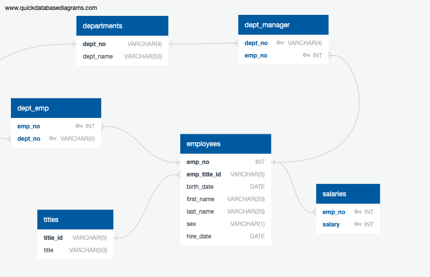

# SQL-Analysis

## Website: 
[website](https://github.com/mrslinton/SQL-Analysis/tree/main)

## Description
In this project, we did the work of a data engineer in which we modeled and analyzed employee data 

## Table of Contents
- [Installation](#installation)
- [Usage](#usage)
- [Credits](#credits)
- [License](#license)
- [Features](#features)

- [Contact](#contact)

## Installation
Postgres, SQL, QuickDBD

## Usage
Run the schema and analysis script

## Credits
Jennifer Harris

## License
MIT

## Features
ERD, schema and analysis about employee data

## Contact
If there are any questions of concerns, I can be reached at:
##### [github: mrslinton](https://github.com/mrslinton)
##### [email: jennifer.v.harris@outlook.com](mailto:jennifer.v.harris@outlook.com)
